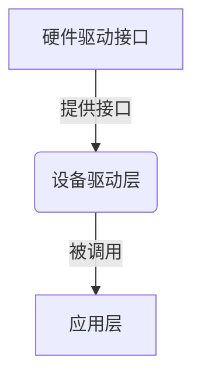
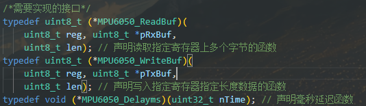

# 仓库简介
* 在学习linux内核驱动的开发时了解到可以通过注册的方式向硬件平台的总线控制器加载驱动，而内核框架提供了现成的如iic的读写函数，让驱动的开发注重于驱动逻辑本身，觉得很有意思便有了该仓库，当然这些驱动的有点可能只是当有多个相同设备时编写代码更容易复用。
* 记录一些用过的驱动，均使用函数注入的方式实现，以提高驱动的可迁移性
* 该仓库遵守GPL3.0协议，使用请注明出处

# 图示

该仓库实现的驱动只是提供了设备驱动层，具体板子上的硬件接口还需用户自行补充。

# 如何使用-示例
1. 查看驱动的头文件，查看声明需要实现的硬件层驱动，如device/Lib/mpu6050.h中


2. 创建如bsp/lib/bsp_mpu6050.h
```c
uint8_t Bsp_MPU6050ReadBuf(uint8_t reg, uint8_t *pRxBuf, uint8_t len); // 声明读取指定寄存器上多个字节的函数
uint8_t Bsp_MPU6050WriteBuf(uint8_t reg, uint8_t *pTxBuf, uint8_t len); // 声明写入指定寄存器指定长度数据的函数
void Bsp_MPU6050Delayms(uint32_t nTime);  // 声明毫秒延迟函数
```
3. 在bsp/src/bsp_mpu6050.c中定义上面的.h的函数实现,如果使用hal库则可这样实现
```c
/**
 * @brief 向ist8310设备驱动提供iic读取多个字节的硬件驱动接口
 *
 * @param reg 要读取的寄存器
 * @param pRxBuf 用于接收数据的数组
 * @param len 接收的数据长度
 * @return uint8_t 状态值
 */
uint8_t Bsp_MPU6050ReadBuf(uint8_t reg, uint8_t *pRxBuf, uint8_t len) {
  uint8_t status;
  status = HAL_I2C_Mem_Read(&MPU6050_IIC, MPU6050_ADDR, reg, I2C_MEMADD_SIZE_8BIT, pRxBuf, len, 10);
  return status;
}
```
这样既可抹平不同平台的差异，只需提供底层的硬件接口函数即可
4. 在应用层使用时直接调用mpu6050.h中提供的函数即可。隐藏了驱动内部的细节，让开发者能注重自己的部分
